

  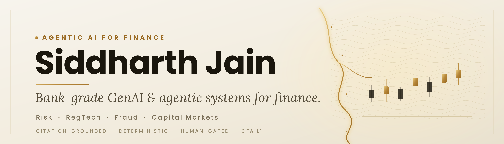

  &nbsp;&nbsp;
  &nbsp;&nbsp;
  

 

I'm an **AI/ML Engineer** building **GenAI and agentic systems for finance** — risk, RegTech, fraud, and capital markets. I spent a year shipping enterprise AI in manufacturing (10 plants, 300+ daily users), and I'm now **all-in on Finance × AI**.

I don't just prototype — I ship full, end-to-end systems engineered to **bank-grade** standards: leakage-safe modeling, deterministic math, citation-grounded reasoning, eval-as-CI-gate, and human approval gates. My north star is **AI agents that actually understand finance**, where every number is computed, every claim is sourced, and a human holds the final gate. Currently a **CFA Level 1 candidate**.

If you only open one project, start with **[PRAETOR](https://github.com/sidnov6/praetor)** ([live demo](https://sidnov6-praetor.hf.space)) or **[DELPHI](https://github.com/sidnov6/DELPHI)** ([live demo](https://sidnov6-delphi.hf.space)) — then **[CreditForge](https://github.com/sidnov6/CreditForge)** and **[QUORUM](https://github.com/sidnov6/quorum-investment-committee)**.

 

  <a href="https://github.com/sidnov6/praetor">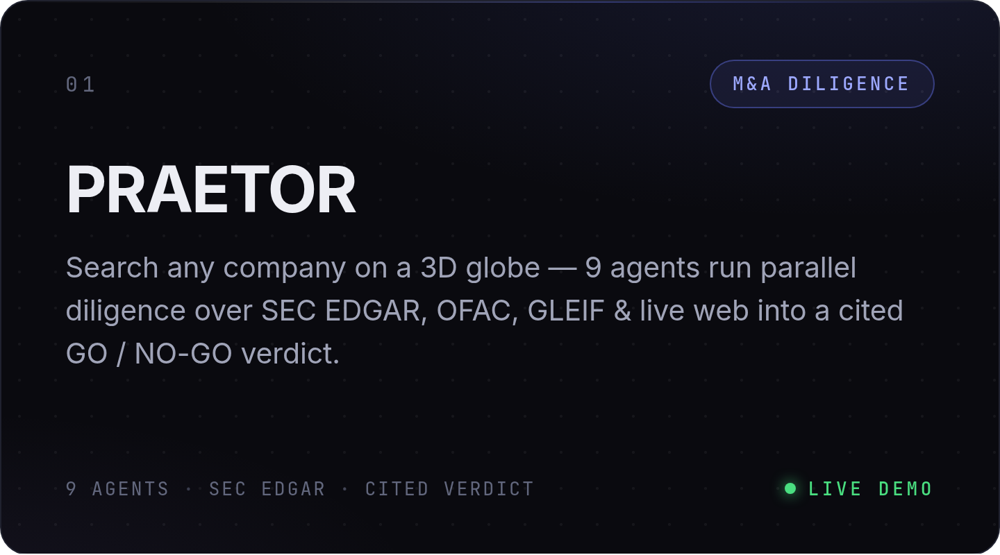</a>
  <a href="https://github.com/sidnov6/DELPHI">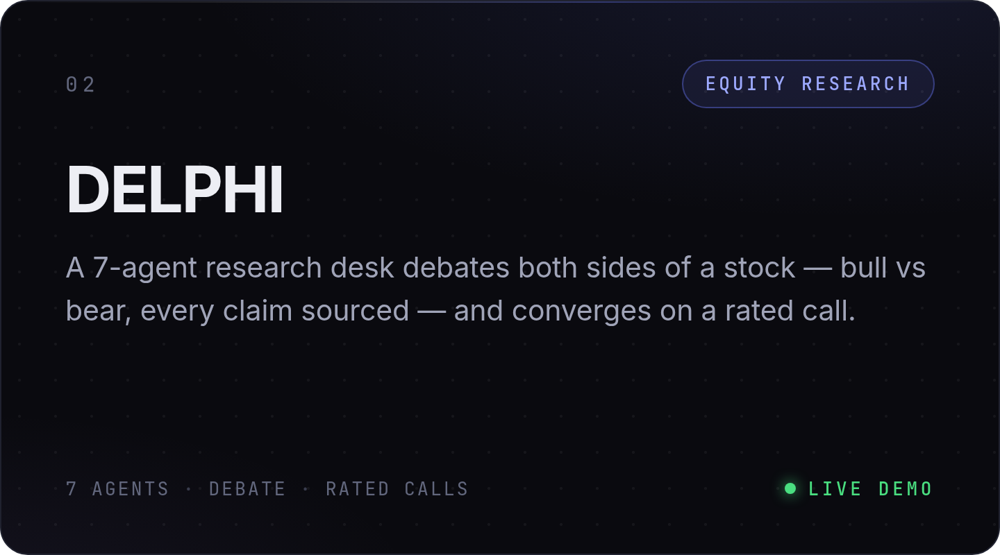</a>

  <a href="https://github.com/sidnov6/CreditForge">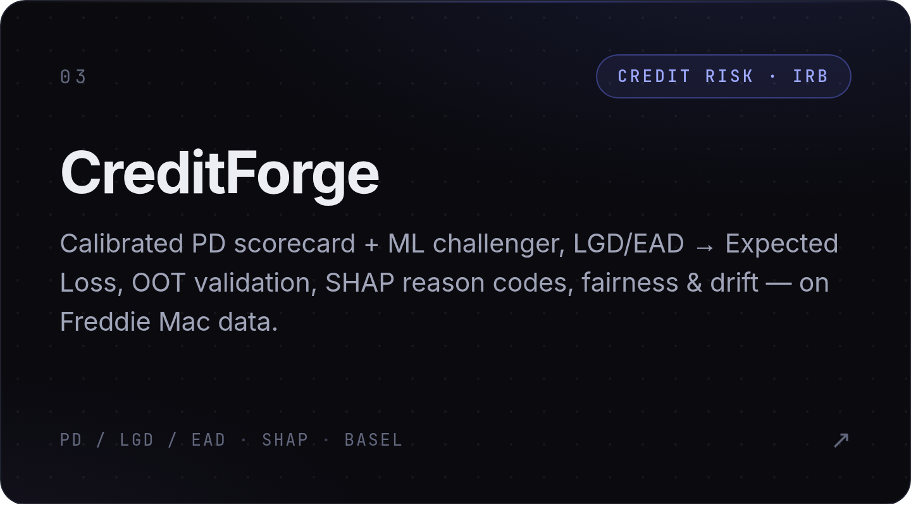</a>
  <a href="https://github.com/sidnov6/quorum-investment-committee">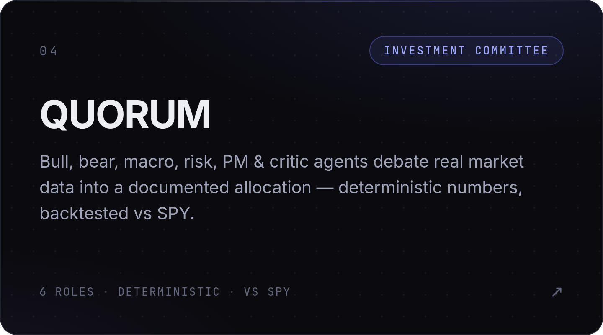</a>

  <a href="https://github.com/sidnov6/regradar">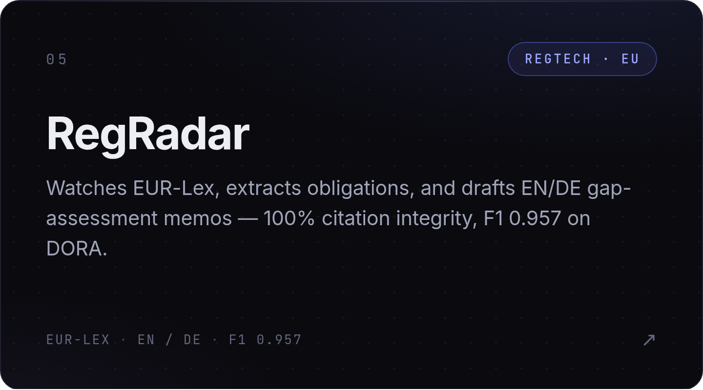</a>
  <a href="https://github.com/sidnov6/recoupe">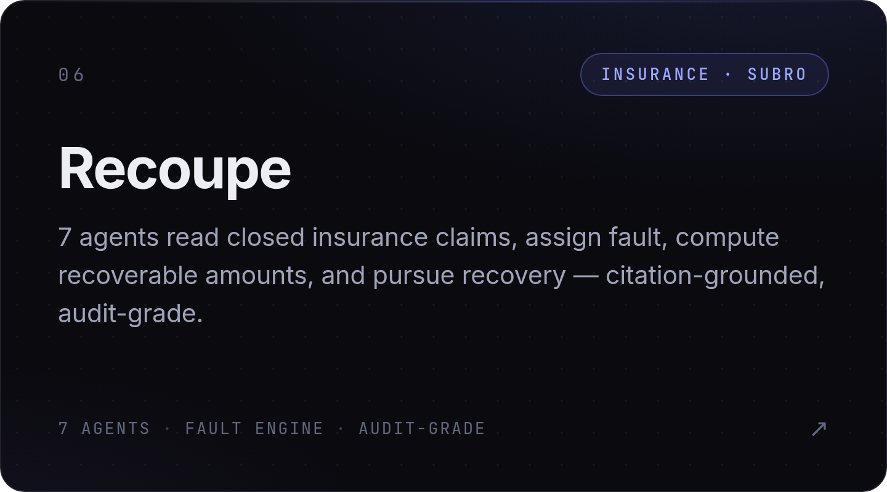</a>

  <a href="https://github.com/sidnov6/aegis-live">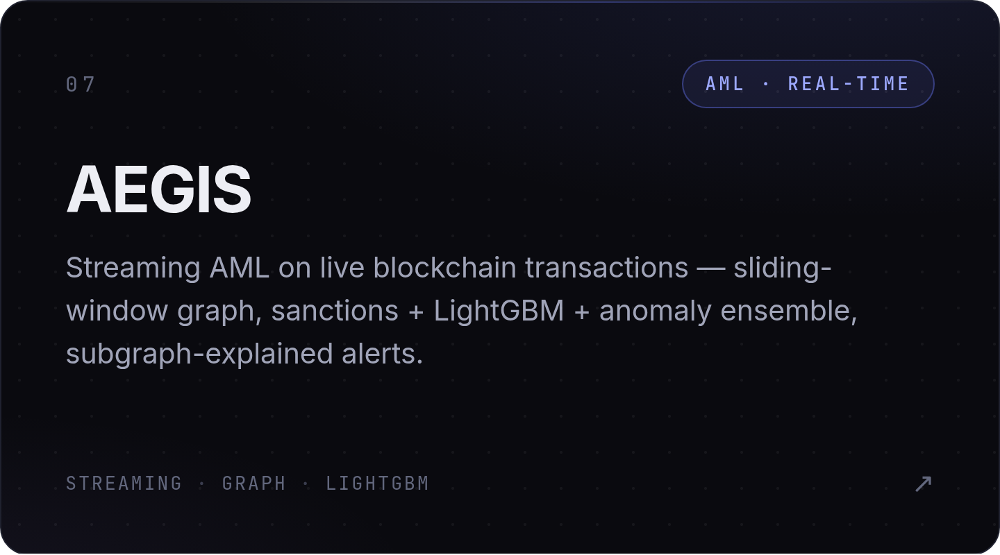</a>
  <a href="https://github.com/sidnov6/aeolus-fleet-brain">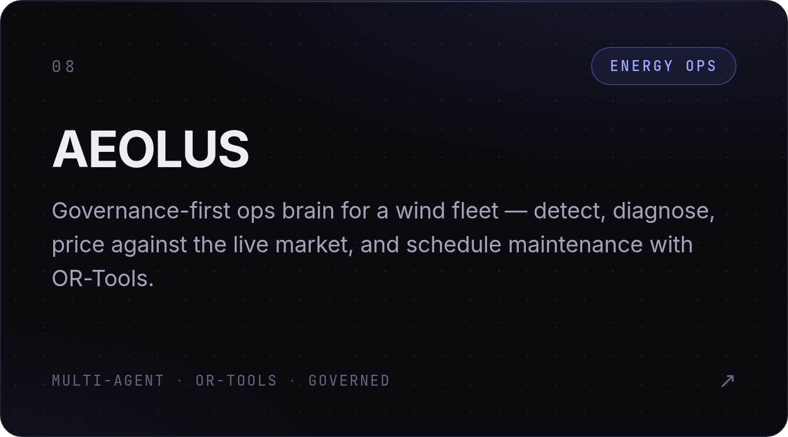</a>

  <a href="https://github.com/sidnov6/CADUCEUS">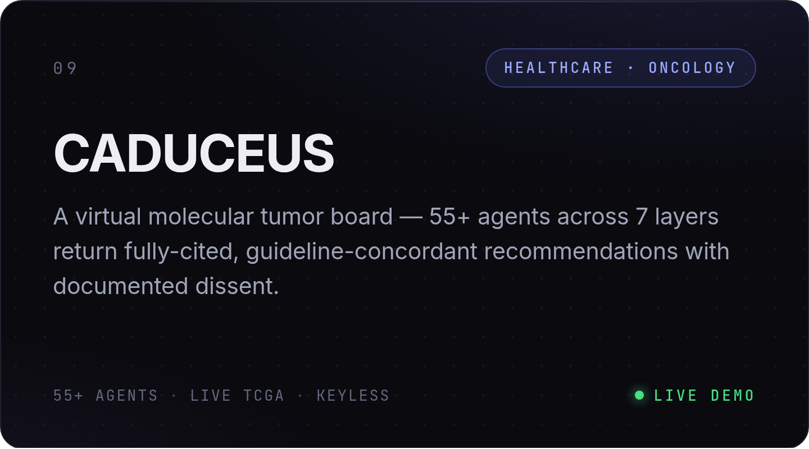</a>
  <a href="https://github.com/sidnov6?tab=repositories">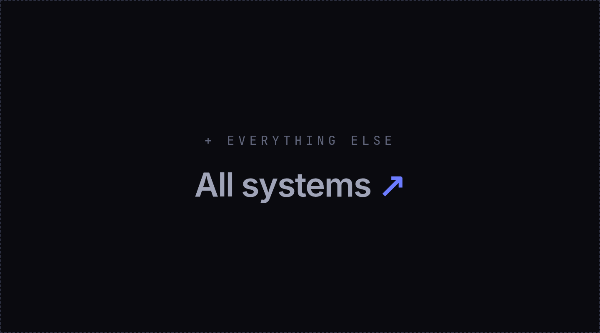</a>

⚡ **Live demos** ([PRAETOR](https://sidnov6-praetor.hf.space) · [DELPHI](https://sidnov6-delphi.hf.space) · [CADUCEUS](https://sidnov6-caduceus.hf.space)) run on free-tier LLM keys with hard rate limits — built for a quick walkthrough, not load-testing. A 429 is the free quota, not the architecture. CADUCEUS was born from my time at the Wallace H. Coulter Department of Biomedical Engineering and runs keyless on real de-identified TCGA data.

 
 

  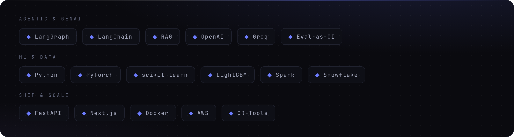

  
  

I'm looking for roles, mentors, and collaborators in **fintech, quant, and bank-AI**. If you build, hire, or invest in this space — let's talk.

  &nbsp;&nbsp;
  &nbsp;&nbsp;
  

