

  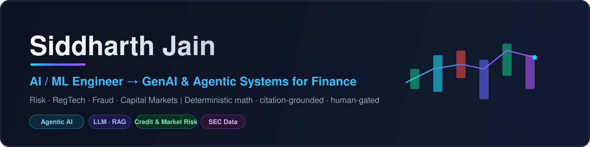

### Hi there 👋

I'm an **AI/ML Engineer** building **GenAI and agentic systems for finance** — risk, RegTech, fraud, and capital markets. I spent a year shipping enterprise AI in manufacturing (10 plants, 300+ daily users), and I'm now **all-in on Finance × AI**.

I don't just prototype — I ship full, end-to-end systems engineered to **bank-grade** standards: leakage-safe modeling, deterministic math, citation-grounded reasoning, eval-as-CI-gate, and human approval gates. My north star is **AI agents that actually understand finance**, where every number is computed, every claim is sourced, and a human holds the final gate. Currently a **CFA Level 1 candidate**.

If you only open one project, start with **[CreditForge](https://github.com/sidnov6/CreditForge)** (it has a live demo) or **[QUORUM](https://github.com/sidnov6/quorum-investment-committee)**.

### 🧭 Currently Building — Latest Systems

  <a href="https://github.com/sidnov6/cassandra" target="_blank">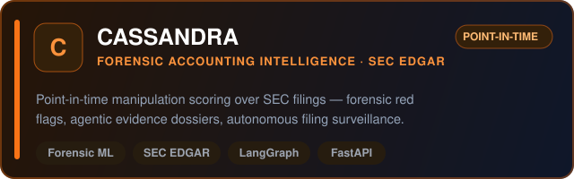</a>
  <a href="https://github.com/sidnov6/trident" target="_blank">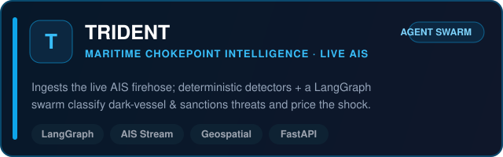</a>

  <a href="https://github.com/sidnov6/red-queen" target="_blank">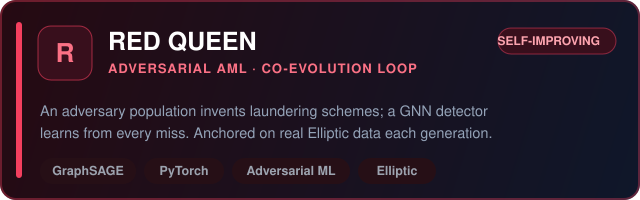</a>
  <a href="https://github.com/sidnov6/boreas" target="_blank">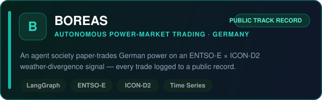</a>

### 🚀 Flagship Projects — Finance × AI

  <a href="https://github.com/sidnov6/CreditForge" target="_blank">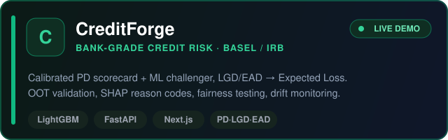</a>
  <a href="https://github.com/sidnov6/quorum-investment-committee" target="_blank">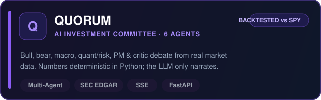</a>

  <a href="https://github.com/sidnov6/regradar" target="_blank">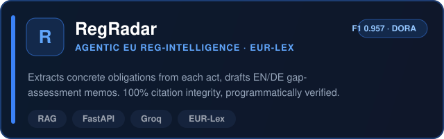</a>
  <a href="https://github.com/sidnov6/recoupe" target="_blank">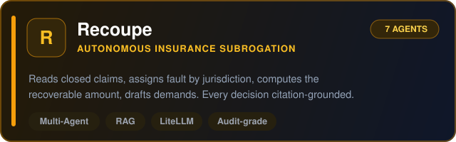</a>

### 🛰️ More Systems

  <a href="https://github.com/sidnov6/DELPHI" target="_blank">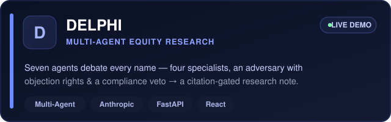</a>
  <a href="https://github.com/sidnov6/praetor" target="_blank">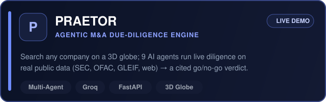</a>

  <a href="https://github.com/sidnov6/aegis-live" target="_blank">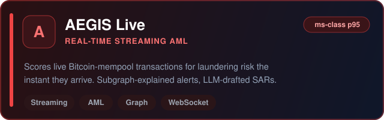</a>
  <a href="https://github.com/sidnov6/aeolus-fleet-brain" target="_blank">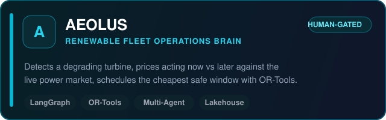</a>

> ⚠️ **Live demos run on free-tier LLM keys** (hard rate limits + daily token caps). They're built for a quick walkthrough, not load-testing — if a demo throttles or returns a 429, that's the free quota, not the architecture. The full code is here on GitHub.

### 🛠️ Tech Stack

### 📊 GitHub Stats

  
  

### 🤝 Let's build the future of Finance × AI

I'm looking for roles, mentors, and collaborators in **fintech, quant, and bank-AI**. If you build, hire, or invest in this space — let's talk.

  
  
  

