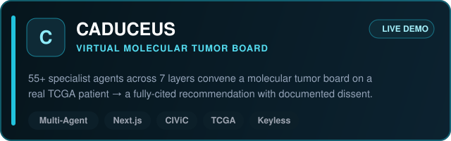

<strong>AI/ML Engineer</strong> &nbsp;·&nbsp; GenAI &amp; Agentic Systems for Finance

Risk &nbsp;·&nbsp; RegTech &nbsp;·&nbsp; Fraud &nbsp;·&nbsp; Capital Markets &nbsp;—&nbsp; citation-grounded &nbsp;·&nbsp; deterministic &nbsp;·&nbsp; human-gated

<a href="https://github.com/sidnov6/praetor">PRAETOR</a> &nbsp;·&nbsp;
<a href="https://github.com/sidnov6/CreditForge">CreditForge</a> &nbsp;·&nbsp;
<a href="https://github.com/sidnov6/quorum-investment-committee">QUORUM</a> &nbsp;·&nbsp;
<a href="https://github.com/sidnov6/CADUCEUS">CADUCEUS</a>

---

### Hi there 👋

I'm an **AI/ML Engineer** building **GenAI and agentic systems for finance** — risk, RegTech, fraud, and capital markets. I spent a year shipping enterprise AI in manufacturing (10 plants, 300+ daily users), and I'm now **all-in on Finance × AI**.

I don't just prototype — I ship full, end-to-end systems engineered to **bank-grade** standards: leakage-safe modeling, deterministic math, citation-grounded reasoning, eval-as-CI-gate, and human approval gates. My north star is **AI agents that actually understand finance**, where every number is computed, every claim is sourced, and a human holds the final gate. Currently a **CFA Level 1 candidate**.

If you only open one project, start with **[PRAETOR](https://github.com/sidnov6/praetor)** (3D globe + 9 live AI agents, [live demo](https://sidnov6-praetor.hf.space)), **[CreditForge](https://github.com/sidnov6/CreditForge)**, or **[QUORUM](https://github.com/sidnov6/quorum-investment-committee)**.

---

### 🚀 Flagship Projects — Finance × AI

---

### 🛰️ More Systems

---

### 🧬 Healthcare × Agentic AI

*Born from my time at the **Wallace H. Coulter Department of Biomedical Engineering** — a multi-agent **molecular tumor board**: 55+ specialist agents across 7 layers deliberate over a multimodal oncology case and return a fully-cited, guideline-concordant recommendation with **documented dissent** and a human on the final gate. Runs offline on synthetic cases, or **live on a real de-identified TCGA patient** (variants → CIViC, drugs → openFDA, trials → ClinicalTrials.gov, literature → Europe PMC). **No API keys — keyless and free.** [Live demo](https://sidnov6-caduceus.hf.space).*

> ⚠️ **Live demos run on free-tier LLM keys** (hard rate limits + daily token caps). They're built for a quick walkthrough, not load-testing — if a demo throttles or returns a 429, that's the free quota, not the architecture. The full code is here on GitHub.

---

### 🛠️ Tech Stack

---

### 📊 GitHub Stats

---

### 🤝 Let's build the future of Finance × AI

I'm looking for roles, mentors, and collaborators in **fintech, quant, and bank-AI**. If you build, hire, or invest in this space — let's talk.

